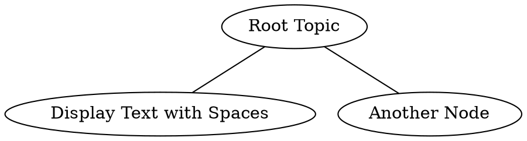
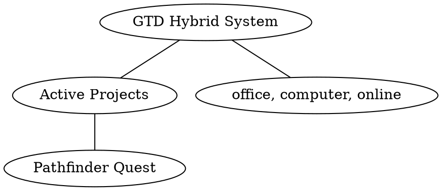

# DOT Syntax Fixes for Diagram Generation

## Problem

The diagram generation tool was creating invalid DOT/Graphviz syntax when using GTD data. Common errors:

1. **Invalid edge syntax**: `ActiveProjects -- Pathfinder Quest: [Name]` 
   - Problem: Can't use colons, brackets, or text directly after `--`
   
2. **Node IDs with spaces/special characters**: Not properly quoted or simplified
   - Problem: DOT requires simple node IDs (alphanumeric + underscore only)

3. **Nodes used before definition**: Referencing nodes in edges that weren't defined
   - Problem: All nodes must be defined before use

## Solution

### Enhanced Prompts

1. **Improved DOT prompt** in `bin/gtd-diagram`:
   - More explicit syntax requirements
   - Step-by-step process explanation
   - Clear examples of invalid vs valid syntax
   - Emphasis on simple node IDs and proper label attributes

2. **Enhanced system prompts**:
   - Added DOT-specific syntax reminders
   - Emphasizes: simple IDs, define nodes first, simple edges

3. **Format-aware prompt enhancement**:
   - When GTD data is included with DOT format, adds explicit syntax reminders
   - Warns about common pitfalls

### Correct DOT Syntax Pattern

**Valid Structure:**


**Key Rules:**
- Node IDs: Simple alphanumeric + underscore (Node1, Proj_1, TaskA)
- Labels: Use [label="Display Text"] for all display text
- Edges: Simple syntax `NodeID1 -- NodeID2` (no text after --)
- Define before use: All nodes defined first, then edges

## Fixed Example

**Original (Invalid):**
```dot
graph G {
  ActiveProjects -- Pathfinder Quest: [Name]  ❌
  ActiveTasks -- office, computer, online      ❌
}
```

**Fixed (Valid):**


## Testing

To test if your DOT file is valid:

```bash
# Check syntax
dot -Tpng your-file.dot -o output.png

# If it works, syntax is correct!
```

## Future Improvements

The enhanced prompts should now generate correct DOT syntax automatically. If you encounter issues:

1. Check the generated DOT file for syntax errors
2. Look for: colons, brackets in edges, undefined nodes, spaces in node IDs
3. Report the issue with the exact error message

The system now has much better guidance for generating valid DOT syntax, especially when using GTD data.

