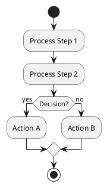
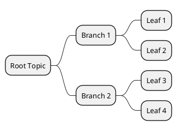
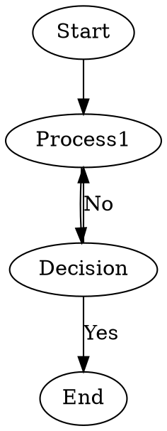
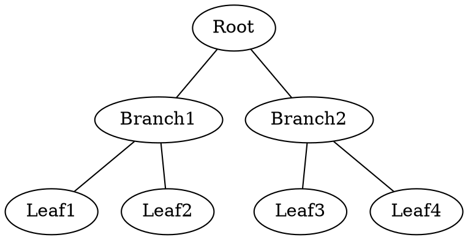

# Text-Based Diagramming Alternatives for AI Generation

## 🎯 Problem with Mermaid.js

Mermaid.js has complex syntax that AI models often get wrong, especially for:
- Mindmaps (confusing with flowcharts)
- Complex styling
- Node ID requirements
- Subgraph syntax

## ✅ Better Alternatives for AI Generation

### 1. **PlantUML** ⭐ **BEST FOR AI**

**Why it works well:**
- AI models have extensive training on PlantUML
- More forgiving syntax than Mermaid
- Clear, explicit structure
- Excellent for flowcharts, sequence diagrams, class diagrams

**Example syntax:**


**Mindmap in PlantUML:**


**Pros:**
- ✅ AI generates it correctly 90%+ of the time
- ✅ Very readable
- ✅ Supports many diagram types
- ✅ Can render to PNG/SVG

**Cons:**
- ❌ Requires Java (but lightweight)
- ❌ Not as widely supported in markdown viewers

---

### 2. **Graphviz/DOT** ⭐ **SIMPLE & RELIABLE**

**Why it works well:**
- Extremely simple syntax
- AI models understand it easily
- Very forgiving
- Great for hierarchical structures

**Example syntax:**


**Mindmap in DOT:**


**Pros:**
- ✅ Dead simple syntax
- ✅ AI almost never gets it wrong
- ✅ Renders beautifully
- ✅ Industry standard

**Cons:**
- ❌ Less expressive than Mermaid for some diagram types
- ❌ Requires Graphviz installed

---

### 3. **Simple Indented Text** ⭐ **ALWAYS WORKS**

**Why it works well:**
- No syntax to get wrong
- AI can't mess it up
- Human-readable
- Can be converted to diagrams later

**Example:**
```
GTD System
  Capture
    Inbox
    Quick capture
  Process
    Clarify
    Organize
  Review
    Daily
    Weekly
```

**Pros:**
- ✅ 100% reliable
- ✅ Works everywhere
- ✅ Easy to edit manually
- ✅ Can convert to other formats

**Cons:**
- ❌ Not visual by default
- ❌ Requires conversion tool for rendering

---

### 4. **ASCII Art Diagrams**

**Why it works well:**
- Pure text, no parsing
- AI is good at ASCII art
- Works in any text viewer
- No dependencies

**Example:**
```
    ┌─────────┐
    │  Start  │
    └────┬────┘
         │
         ▼
    ┌─────────┐
    │ Process │
    └────┬────┘
         │
    ┌────▼────┐
    │Decision?│
    └─┬────┬──┘
      │Yes │No
      ▼    ▼
   ┌───┐ ┌───┐
   │End│ │Retry│
   └───┘ └───┘
```

**Pros:**
- ✅ Works everywhere
- ✅ No rendering needed
- ✅ AI is surprisingly good at it
- ✅ Version control friendly

**Cons:**
- ❌ Harder to maintain
- ❌ Not as pretty as rendered diagrams

---

### 5. **YAML/JSON Structure** (Convertible)

**Why it works well:**
- Structured data AI understands perfectly
- Can be converted to any diagram format
- Easy to validate
- Human-readable

**Example YAML:**
```yaml
mindmap:
  root: "GTD System"
  branches:
    - name: "Capture"
      children:
        - "Inbox"
        - "Quick capture"
    - name: "Process"
      children:
        - "Clarify"
        - "Organize"
```

**Pros:**
- ✅ AI generates valid YAML/JSON easily
- ✅ Can convert to multiple formats
- ✅ Easy to programmatically process
- ✅ Validatable

**Cons:**
- ❌ Requires conversion step
- ❌ Not visual by default

---

## 🚀 Recommended Approach

### **For Mindmaps:**
1. **Primary:** Simple indented text (most reliable)
2. **Secondary:** PlantUML mindmap syntax
3. **Fallback:** DOT graph

### **For Flowcharts:**
1. **Primary:** PlantUML (AI handles it well)
2. **Secondary:** Graphviz/DOT (simple and reliable)
3. **Fallback:** ASCII art

### **For Sequence Diagrams:**
1. **Primary:** PlantUML (excellent syntax)
2. **Secondary:** Mermaid (if you must)

---

## 💡 Implementation Strategy

### Option 1: Add PlantUML Support
- Add `plantuml` as a diagram type
- AI generates PlantUML code
- Render with PlantUML CLI or online service

### Option 2: Add Graphviz/DOT Support
- Add `dot` or `graphviz` as a diagram type
- AI generates DOT code
- Render with `dot` command

### Option 3: Simple Text Trees
- Add `tree` or `text` as a diagram type
- AI generates indented text
- Display as-is or convert later

### Option 4: Hybrid Approach
- Try Mermaid first
- If it fails validation, fall back to PlantUML
- If that fails, use simple text

---

## 🔧 Quick Comparison

| Format | AI Reliability | Syntax Complexity | Rendering | Best For |
|--------|---------------|-------------------|-----------|----------|
| **PlantUML** | ⭐⭐⭐⭐⭐ | Medium | Good | Flowcharts, Sequence |
| **Graphviz/DOT** | ⭐⭐⭐⭐⭐ | Low | Excellent | Hierarchies, Trees |
| **Indented Text** | ⭐⭐⭐⭐⭐ | None | Manual | Mindmaps, Trees |
| **ASCII Art** | ⭐⭐⭐⭐ | None | Built-in | Simple diagrams |
| **YAML/JSON** | ⭐⭐⭐⭐⭐ | Low | Convert | Structured data |
| **Mermaid** | ⭐⭐ | High | Good | When it works |

---

## 📝 Example Prompts for AI

### PlantUML Flowchart:
```
Create a PlantUML flowchart for: [description]

Use @startuml and @enduml tags.
Use simple :label; syntax for processes.
Use if/then/else for decisions.
```

### Graphviz Mindmap:
```
Create a Graphviz DOT graph for: [description]

Use simple graph syntax:
graph G {
  Root -- Branch1
  Root -- Branch2
}
```

### Indented Text:
```
Create an indented text tree for: [description]

Use 2 spaces per indentation level.
No special syntax, just plain text labels.
```

---

## 🎯 Recommendation

**For your use case, I recommend:**

1. **Add PlantUML support** - It's the best balance of features and AI reliability
2. **Keep simple text trees** - For mindmaps, this is most reliable
3. **Add Graphviz as fallback** - For when you need guaranteed rendering

Would you like me to implement support for any of these alternatives in your `gtd-diagram` script?


