# Mermaid Diagram Syntax Fixes

## Common Errors and How to Fix Them

### ❌ Error 1: Invalid Style Block Syntax

**Problem:**
```mermaid
style AA[System Architecture] fill:#3e4452,stroke:#507f1b;
```

**Why it's wrong:**
- Style blocks can only reference **node IDs**, not node definitions with brackets
- `AA[System Architecture]` is a node definition, not a node ID
- The node `AA` doesn't exist in your graph

**Fix:**
- Remove these style blocks entirely, OR
- Create actual nodes with those IDs first:
```mermaid
AA["System Architecture"]
style AA fill:#3e4452,stroke:#507f1b;
```

### ❌ Error 2: Styling Non-Existent Nodes

**Problem:**
Your diagram defines nodes `A` through `N`, but then tries to style nodes `AA`, `BB`, `CC`, etc. that don't exist.

**Fix:**
- Only style nodes that are actually defined in your graph
- Remove style blocks for non-existent nodes

### ❌ Error 3: Subgraph Labels with Spaces

**Problem:**
```mermaid
subgraph Senior SRE Career Growth
```

**Fix:**
```mermaid
subgraph "Senior SRE Career Growth"
```

### ❌ Error 4: Incomplete Style Blocks

**Problem:**
```mermaid
style LL[
```

**Fix:**
- Remove incomplete lines, or complete them properly

---

## Your Diagram - Corrected Version

Here's a corrected version of your diagram:

```mermaid
graph LR
    subgraph "Senior SRE Career Growth"
        A["Lead Engineer"] --> B("Senior DevOps Engineer")
        B --> C("Architectural SRE Specialist")
        C --> D("Specialized Security Analyst")
        D --> E("Security Platform Engineer")
        E --> F("Incident Responder")
        F --> G("Value Stream Optimization Specialist")
        G --> H("System Reliability Engineer")
        H --> I("Performance Tuning Lead")
        I --> J("Code Review Champion")
        J --> K("Documentation Expert")
        K --> L("Technical Lead")
        L --> M("Product Manager - Security Focus")
        M --> N("Strategic SRE Alignment Lead")
    end
    
    subgraph "Key Relationships - Systems"
        A -- "System Architecture" --> B
        B -- "Process Optimization" --> C
        C -- "Security Incident Response" --> D
        D -- "Monitoring Tools" --> E
        E -- "Root Cause Analysis" --> F
        F -- "Automation Scripting" --> G
        G -- "Threat Intelligence" --> H
        H -- "Cost Reduction Strategies" --> I
        I -- "Capacity Planning" --> J
        J -- "Communication Protocol" --> K
        K -- "Stakeholder Management" --> L
        L --> N
    end
    
    subgraph "Key Relationships - Development"
        A -- "Code Quality Standards" --> B
        B -- "Testing Frameworks" --> C
        C -- "Performance Profiling" --> D
        D -- "System Design Reviews" --> E
        E -- "UI/UX Analysis" --> F
        F -- "Data Visualization" --> G
        G -- "API Security" --> H
        H -- "Infrastructure Optimization" --> I
    end
    
    style A fill:#f2a163,stroke:#507f1b,stroke-width:2px
    style B fill:#e9c482,stroke:#507f1b,stroke-width:2px
    style C fill:#3e4452,stroke:#507f1b,stroke-width:2px
    style D fill:#c89123,stroke:#507f1b,stroke-width:2px
    style E fill:#94899d,stroke:#507f1b,stroke-width:2px
    style F fill:#e8e7e7,stroke:#507f1b,stroke-width:2px
    style G fill:#9c899c,stroke:#507f1b,stroke-width:2px
    style H fill:#d3248c,stroke:#507f1b,stroke-width:2px
    style I fill:#94899d,stroke:#507f1b,stroke-width:2px
    style J fill:#e8e7e7,stroke:#507f1b,stroke-width:2px
    style K fill:#3e4452,stroke:#507f1b,stroke-width:2px
    style L fill:#c89123,stroke:#507f1b,stroke-width:2px
    style M fill:#94899d,stroke:#507f1b,stroke-width:2px
    style N fill:#e8e7e7,stroke:#507f1b,stroke-width:2px
```



## Key Changes Made:

1. ✅ **Quoted subgraph labels** - Added quotes around labels with spaces
2. ✅ **Removed invalid style blocks** - Removed all `style AA[...]` blocks
3. ✅ **Only styled existing nodes** - Only style blocks for nodes A through N
4. ✅ **Fixed style syntax** - Added `stroke-width:2px` and removed trailing semicolons (optional but cleaner)
5. ✅ **Quoted node labels** - Added quotes around labels with spaces for clarity

## Using the Fix Command

If you have a broken diagram file, you can use:

```bash
gtd-diagram fix <diagram-name>
```

This will automatically:
- Remove invalid style blocks
- Fix subgraph labels
- Clean up syntax errors
- Create a backup of your original file

